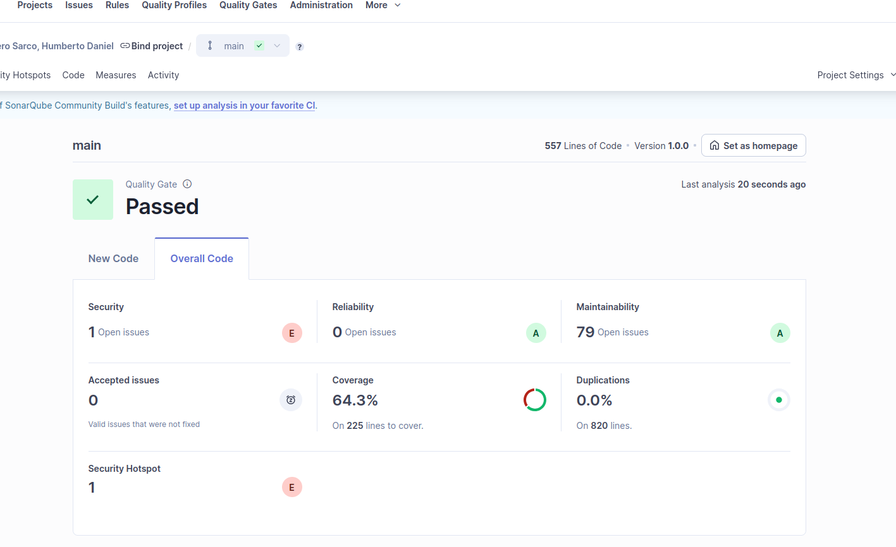

# CS-GradeCalculator

Sistema de cálculo de nota final para estudiantes de UTEC.


## Resultados de calidad y análisis SonarQube

### Calidad requerida


### Resultado del alumno en SonarQube


## Descripción

Implementa el cálculo de notas finales considerando evaluaciones ponderadas, asistencia mínima y políticas de puntos extra según año académico.

## Requisitos Funcionales

- **RF01**: Registro de evaluaciones (nombre, nota, peso)
- **RF02**: Asistencia mínima 75% (penalización a 0 si no cumple)
- **RF03**: Puntos extra según año académico
- **RF04**: Cálculo de nota final ponderada
- **RF05**: Detalle del cálculo

## Requisitos No Funcionales

- **RNF01**: Máximo 10 evaluaciones por estudiante
- **RNF02**: Soporte para 50 usuarios concurrentes
- **RNF03**: Cálculo determinista
- **RNF04**: Tiempo de respuesta < 300ms

## Compilar y Ejecutar

```bash
# Compilar
mvn clean compile

# Ejecutar tests
mvn test

# Ejecutar tests con cobertura JaCoCo
mvn clean test jacoco:report

# Ver reporte de cobertura
# Abrir: target/site/jacoco/index.html

# Ejecutar aplicación
mvn exec:java -Dexec.mainClass="GradeCalculatorApp"
```

## Cobertura de Código

- **Actual**: 62%
- **Tests**: 73 pruebas unitarias
- **Framework**: JUnit 5 + JaCoCo

## Estructura


### Principios de Diseño

- Separación de responsabilidades
- Inyección de dependencias
- Inmutabilidad de modelos
- Diseño stateless (RNF02)
- Validación exhaustiva

## Ejemplo de Ejecución

```
Código: U202012345
Evaluaciones: 3
  - PC1: 15.0 (30%)
  - PC2: 16.0 (30%)
  - Examen Final: 14.0 (40%)
Asistencia: Sí
Año: 2025
Puntos extra: Sí

Resultado: Nota Final = 15.90
```

## 📅 Fecha

Noviembre 2025

---

**Nota**: Este sistema es un módulo de cálculo académico. En un entorno de producción debería integrarse con:
- Base de datos para persistencia
- Sistema de autenticación de docentes
- Interfaz gráfica (GUI)
- API REST para integración con otros sistemas
- Logging y auditoría de cálculos


